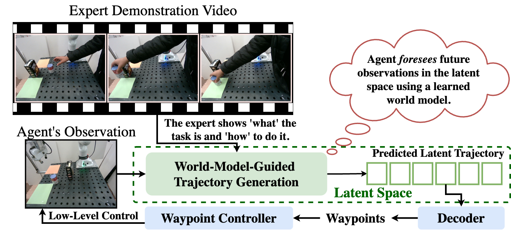
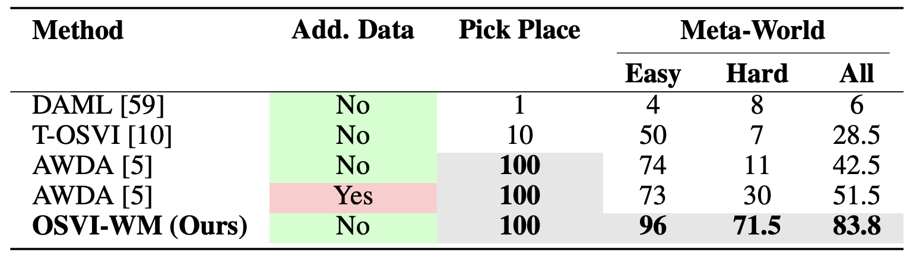
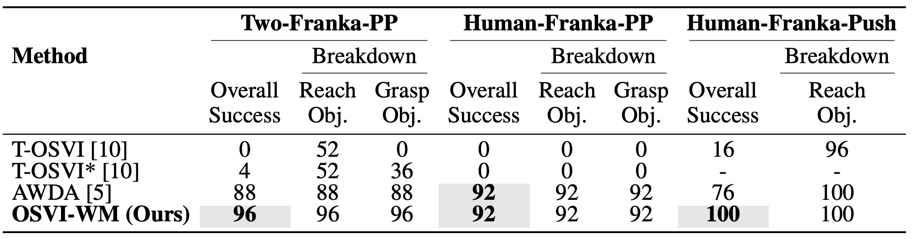

# OSVI-WM: One-Shot Visual Imitation for Unseen Tasks using World-Model-Guided Trajectory Generation
## NeurIPS 2025 

**Authors:** Raktim Gautam Goswami<sup>1</sup>, Prashanth Krishnamurthy<sup>1</sup>, Yann LeCun<sup>2,3</sup>, Farshad Khorrami<sup>1</sup>  
<sup>1</sup> New York University Tandon School of Engineering  
<sup>2</sup> New York University Courant Institute of Mathematical Sciences  
<sup>3</sup> Meta-FAIR

📖 Paper: [OSVI-WM](To Appear)    
📖 Pre-print: [https://arxiv.org/pdf/2505.20425](https://arxiv.org/pdf/2505.20425)  
📹 Video: [https://www.youtube.com/watch?v=QfR6laGZr7A](https://www.youtube.com/watch?v=QfR6laGZr7A)


## 💡 OSVI-WM Contributions
- **Architecture**: An efficient end-to-end imitation learning architecture trained solely on in-domain data, without requiring large-scale pretraining.
- **World Model**: A novel world-model-guided trajectory generation module tailored for OSVI on unseen tasks.
-  **Re-Planning**: Robustness enhancement at test time by using a waypoint controller with re-planning.
- **Experiments**: Extensive experiments in both simulated and real-world settings, demonstrating that OSVI-WM outperforms existing methods on unseen tasks.

<justify>

<p>Fig. 1: OSVI-WM infers the task from the expert demonstration and, along with the agent’s observation “foresees” future latent states using a world-model-guided trajectory generation module. The predicted trajectory is decoded into physical waypoints for control.</p>
</justify>

## 🚀 Code Release Checklist
- [x] Environment Creation
- [x] Dataset Generation
- [x] Meta-World Training code
- [x] Pick-and-Place Training code
- [x] Model Checkpoints
- [ ] Meta-World Evaluation Code
- [ ] Pick-and-Place Evaluation Code

## 🔨 Environment Creation   
```
conda create --name osvi_wm python=3.10
conda activate osvi_wm
pip install numpy torch torchvision einops accelerate opencv-python matplotlib numba
```

**Note:**  
Before running the code, you may need to configure `accelerate` and log in to `wandb`.  
If you prefer not to use them, you can disable them in the configuration files in `config` folder by setting their values to `false`.

## 📊💾 Dataset Generation
Follow the instructions from [https://github.com/MatthewChang/osvi-awda](https://github.com/MatthewChang/osvi-awda) to create the datasets for Meta-World and Pick-and-Place. Once the datasets are generated, create a folder named data inside the current directory.
```
mkdir data
```
Place the generated datasets inside the data folder arranged as 
```
data
├-metaworld
|  ├-assembly-v2
|  ├-basketball-v2
|  ├- ...
|  ├- ...
|  ├- ...
|
├-pick_place
|  ├-panda
|  ├-sawyer
```

## ✈️ Training
Create checkpoint directory
```
mkdir -p checkpoints/metaworld
mkdir -p checkpoints/pp
```
### Train on Meta-World data
```
accelerate launch train_metaworld.py
```
This trains the model on the Meta-World dataset and stores the trained models in checkpoints/metaworld.

### Train on Pick-and-Place data
```
accelerate launch train_pp.py
```
This trains the model on the Pick-and-Place dataset and stores the trained model in checkpoints/pp.


The pre-trained checkpoints for Meta-World and Pick-and-Place can be downloaded from [drive link](https://drive.google.com/drive/folders/1ekflx2fGqf8gVPISV1Jckc77SbhsXCRc?usp=sharing).

**Note**:
As discussed in the paper, early stopping is often necessary when training on Meta-World to prevent overfitting. To address this, the Meta-World training script saves a separate checkpoint after each epoch. This approach ensures that the checkpoint from the final epoch is not automatically assumed to be the best-performing one, allowing for selection of the optimal model based on evaluation performance.

## Results
<justify>

<p>Table 1:  Success rates (in %) comparison on the Meta-World and Pick-and-Place simulation benchmarks. Best results are highlighted. We also report if a method uses additional training data.</p>
</justify>

<justify>

<p>Table 2:  Real-World experiments: Success rates and execution breakdowns (in %) are reported. T-OSVI* denotes T-OSVI [10] aided with end-effector depth sensing for improved grasping.</p>
</justify>

**Experimental result clips for all the benchmarks are available in the [project video](https://www.youtube.com/watch?v=QfR6laGZr7A).**


## 📧 Citation
```bibtex
@article{goswami2025osvi,
  title={Osvi-wm: One-shot visual imitation for unseen tasks using world-model-guided trajectory generation},
  author={Goswami, Raktim Gautam and Krishnamurthy, Prashanth and LeCun, Yann and Khorrami, Farshad},
  journal={arXiv preprint arXiv:2505.20425},
  year={2025}
}
}
```